# Flutter Developer Portfolio

📍 **Location**: Islamabad  
📞 **Contact**: +92-3315232726  
📧 **Email**: [talha.ilyas309@gmail.com](mailto:talha.ilyas309@gmail.com)  
🔗 **LinkedIn Profile**: [LinkedIn](https://www.linkedin.com/in/talha-ilyas-dev)  

---

### 💼 Work Experience

#### Mobile App Developer  
- Working on Flutter and Dart  
- Flutter Front-End Developer  
- Firebase Integration, MVVM Architecture, REST APIs

#### Flutter Internship Remote at Atomix Technologies  
- Completed 6 months Internship  
- [Atomix Technologies LinkedIn](https://www.linkedin.com/company/atomixtechnologies)

#### Final Year Project  
- Educational App which aims to create a user-friendly mobile application that facilitates communication between students and teachers.  
- It provides a bridge between students and teachers.  
- [GitHub Repository: My Educational App](https://github.com/Talhailyas309/MyEducationalApp)

#### Mobile App Developer Internship at NATIONAL EXPANSION PLAN OF NIC’s Kohat  
- Flutter App Developer Internship at NATIONAL EXPANSION PLAN of NIC Kohat

#### Graphic Designer at Startup Pentesters House at NIP NIC’s Kohat  
- Start-up [pentestershouse.pk](https://nep.pitb.gov.pk/node/571)

---

### 🛠️ Technical Skills

- **Languages & Technologies**: Flutter, Dart, Android App Development, C++, Java, DBMS  
- **Other Skills**: Front-End Web Development, Software Project Management, Digital Marketing, Graphic Design

---
### 💻 Projects
#### 1. **Educational App**  
- A mobile application designed to bridge the communication gap between students and teachers.  
- **Technologies**: Flutter, Firebase  
- [GitHub Repository: My Educational App](https://github.com/Talhailyas309/MyEducationalApp) 

  
  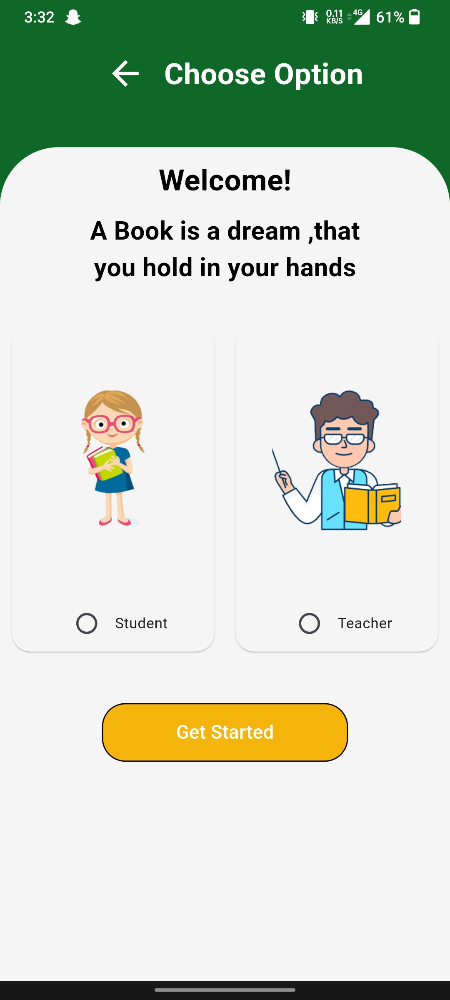
  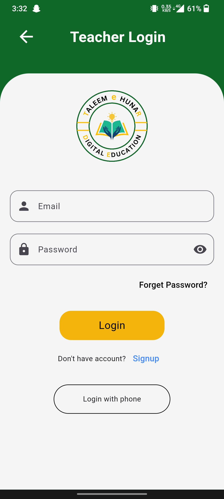
  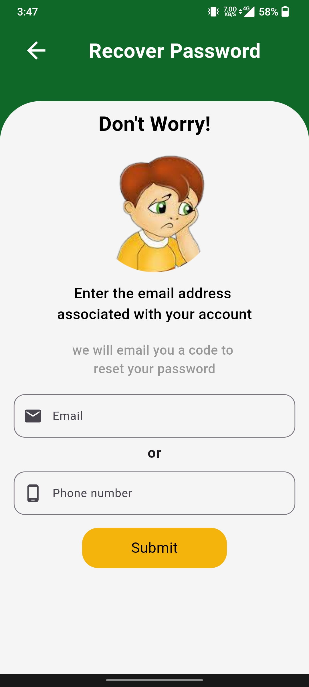
  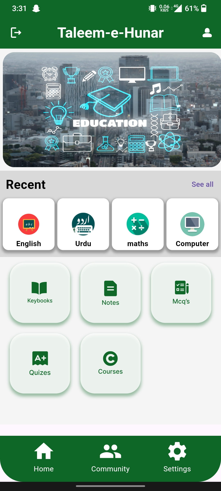
  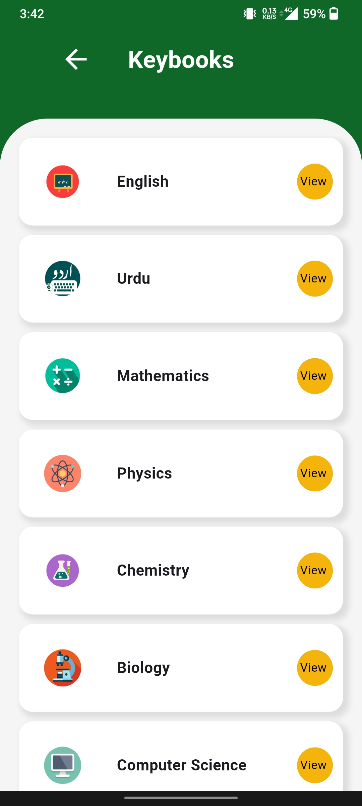
  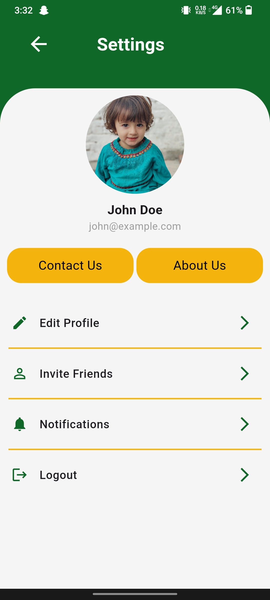

#### 2. **Taskly App**  
- A task management app designed to increase productivity and organization.  
- **Technologies**: Flutter, Firebase  
- [GitHub Repository: Taskly App](https://github.com/Talhailyas309/TasklyApp) 

  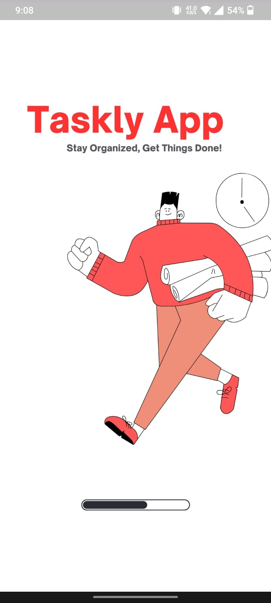
  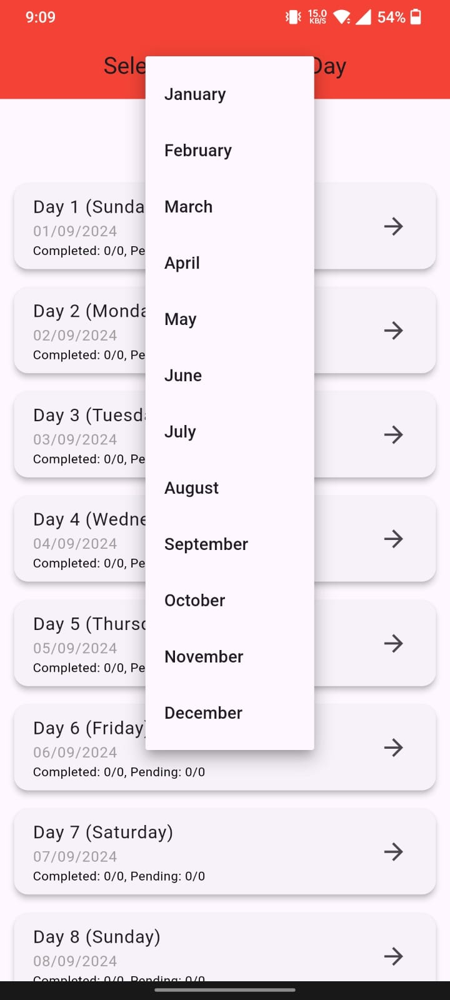
  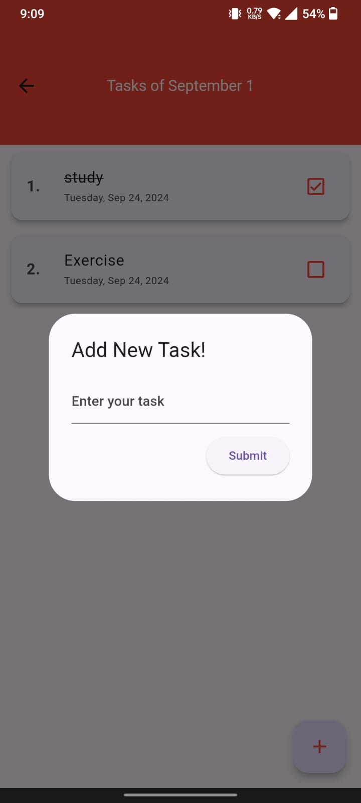
  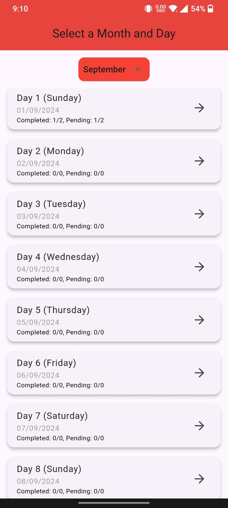
  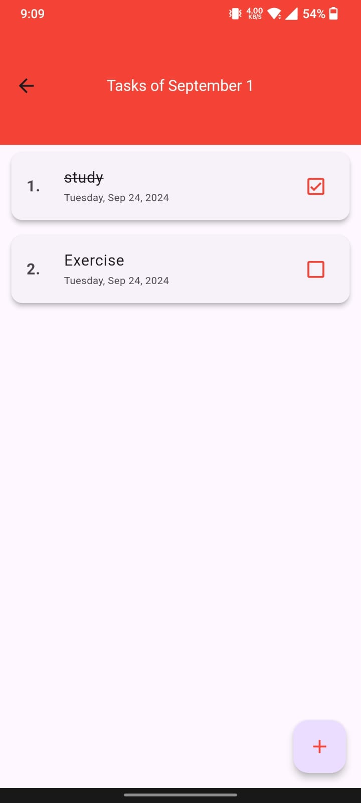

#### 3. **Front-End UI**  
- A task management app designed to increase productivity and organization.  
- **Technologies**: Flutter, Firebase  
- [GitHub Repository: Taskly App](https://github.com/Talhailyas309/TasklyApp) 

  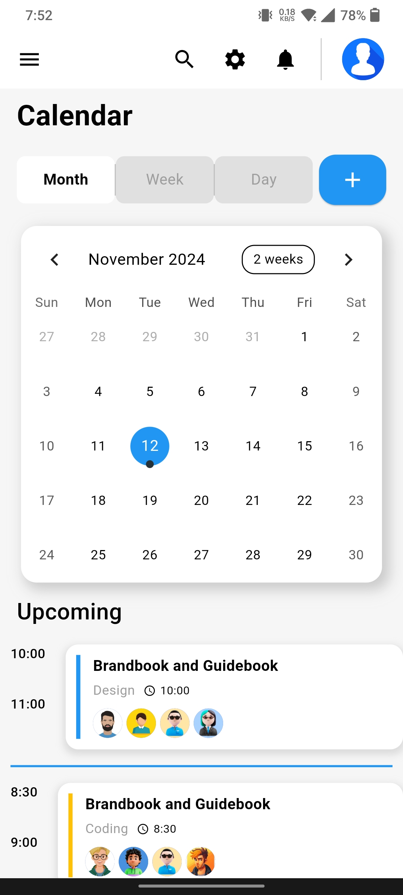
  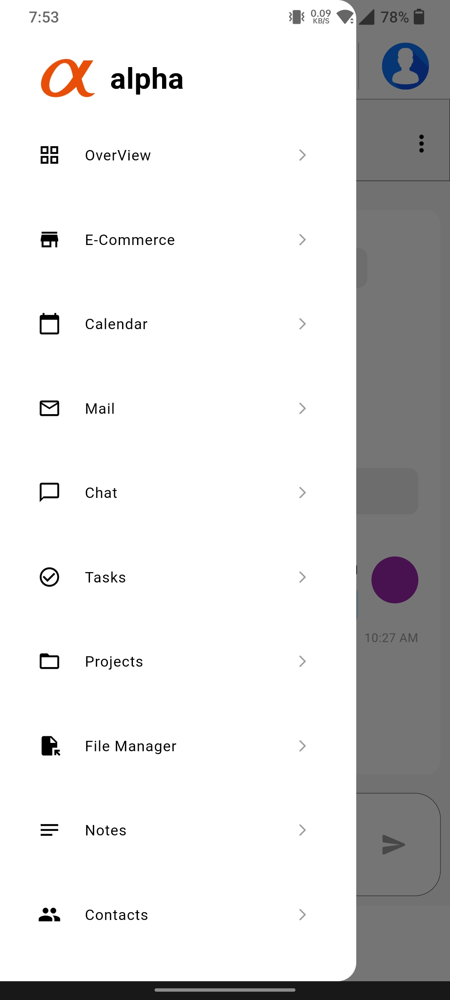
  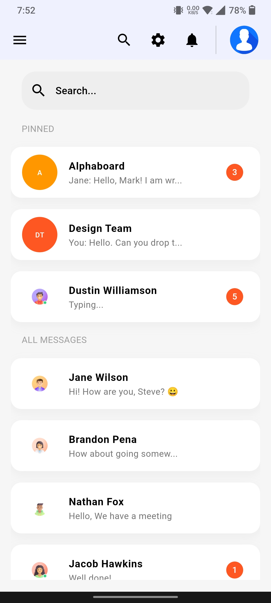
  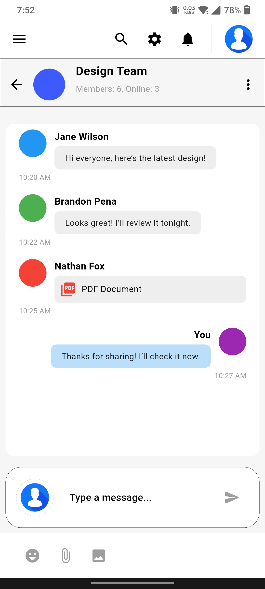
  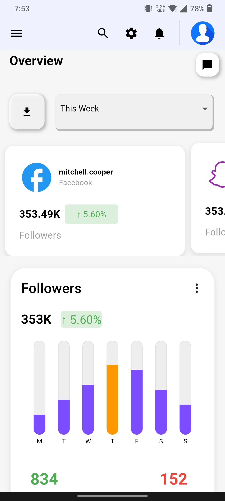
  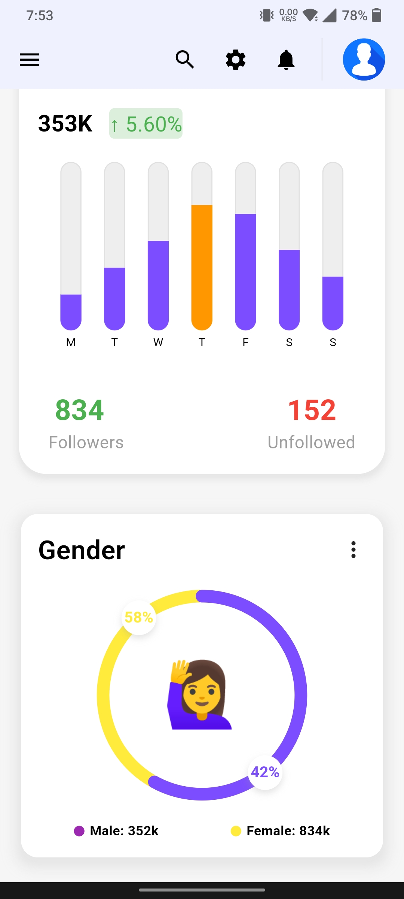
  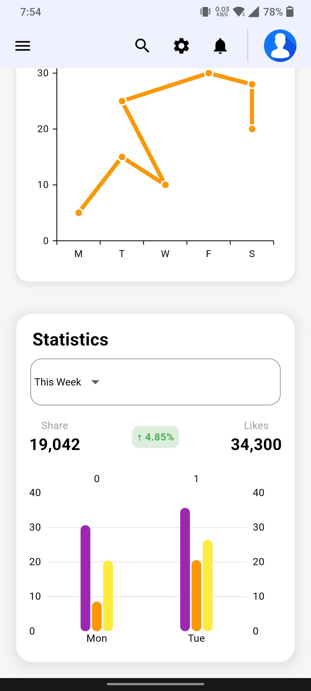

